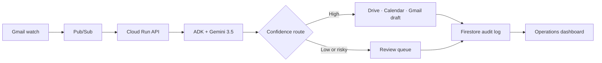

# Brief2Booked

**An autonomous freelance-operations agent for the Taskmaster track.**

The production deployment uses an official Google Cloud Run `run.app` URL generated inside project `brief2booked`. The deployment command prints the exact URL when it finishes.

Brief2Booked watches for a new client enquiry and completes the operational work that normally steals focus from a solo developer: it understands an unstructured brief, qualifies the opportunity, routes uncertain cases, creates a tailored proposal, reserves a follow-up slot, creates delivery tasks, drafts the client reply, and records every decision.

This is not a chatbot. The primary interface is an event-driven operations console; the agent runs asynchronously after a Gmail event and leaves completed work behind.

## The personal friction

Running Texcorp Solutions means switching from engineering into sales operations whenever an enquiry arrives. A promising message can require 30–60 minutes of reading, research, scoping, document preparation, calendar checking, follow-up writing, and pipeline administration. Delays cost leads; rushing creates bad estimates.

Brief2Booked turns that repeated, messy workflow into one observable and failure-tolerant action engine.

## What happens automatically

1. Gmail Watch emits a change event to Pub/Sub.
2. Cloud Run normalizes and deduplicates the event.
3. Google ADK runs Gemini 3.5 against the raw client brief.
4. Gemini classifies service, estimates fit and identifies risks.
5. The coordinator routes the workflow:
   - high confidence → proposal, calendar hold, tasks and reply draft;
   - unclear brief → clarification draft and review queue;
   - unsafe/out-of-scope → no downstream actions.
6. Google Drive receives the proposal.
7. Google Calendar receives a provisional discovery slot.
8. Gmail receives a reply **draft** (never an automatic send).
9. Firestore records state, outputs, timestamps and every tool action.
10. The dashboard shows the proof of action.

## Google technology

| Requirement | Implementation |
| --- | --- |
| Gemini 3.5+ | Gemini 3.5 Flash through Vertex AI |
| Agent framework | Google Agent Development Kit (ADK) 2.0 |
| Cloud infrastructure | Cloud Run, Pub/Sub and Firestore |
| Google tools | Gmail API, Calendar API and Drive API |
| Frontend | React / Next.js dashboard served by Cloud Run |

## Architecture



The event boundary is separated from model reasoning and tool execution. Pub/Sub retries transient delivery failures. Firestore event receipts enforce idempotency. Tool permissions are scoped independently. The Gmail tool only has compose access and creates drafts.

## Repository structure

```text
app/                         Dashboard and interactive proof-of-action demo
backend/
  brief2booked/
    main.py                  Cloud Run API and Pub/Sub receiver
    agent.py                 ADK coordinator and routing policy
    google_tools.py          Scoped Workspace and Firestore actions
    models.py                Validated event, decision and result contracts
  Dockerfile
  requirements.txt
  deploy.sh
docs/
  DEVPOST.md                 Submission-ready project copy
  DEMO_SCRIPT.md             Four-minute video plan
```

## Run the dashboard

Prerequisites: Node.js 22+.

```bash
npm install
npm run dev
```

Open the displayed local URL and choose **Run demo**. The dashboard demo uses safe sample data and does not access external accounts.

## Run the agent API locally

Prerequisites: Python 3.12+, a Google Cloud project, Application Default Credentials, and Vertex AI access.

```bash
cd backend
python -m venv .venv
source .venv/bin/activate
pip install -r requirements.txt
cp .env.example .env
set -a && source .env && set +a
uvicorn brief2booked.main:app --reload --port 8080
```

Try the deterministic demo event:

```bash
curl -X POST http://localhost:8080/v1/demo
```

Keep `DEMO_MODE=true` until Google Workspace credentials and delegated scopes are configured.

## Deploy to Google Cloud

For project `brief2booked` (`147279859950`), open Google Cloud Shell from the project console and run:

```bash
git clone https://github.com/Tatoss/brief2booked-taskmaster.git
cd brief2booked-taskmaster
bash backend/deploy.sh
```

The script enables the required APIs, provisions Firestore in Johannesburg, creates the Pub/Sub topic, authenticated push subscription and least-privilege service accounts, then deploys one production Cloud Run service containing both the dashboard and Gemini 3.5 + ADK agent.

When deployment finishes, it prints URLs similar to:

```text
Dashboard: https://brief2booked-agent-....africa-south1.run.app
Health:    https://brief2booked-agent-....africa-south1.run.app/health
Demo:      https://brief2booked-agent-....africa-south1.run.app/v1/demo
```

The dashboard's **Run demo** button calls the real Cloud Run API, invokes Gemini through Vertex AI and writes the resulting action audit to Firestore.

After the demo deployment, configure Google Workspace domain-wide delegation and a Gmail Watch publisher before changing `DEMO_MODE` to `false`.

The delegated Workspace account needs these minimum OAuth scopes:

- `https://www.googleapis.com/auth/gmail.readonly`
- `https://www.googleapis.com/auth/gmail.compose`
- `https://www.googleapis.com/auth/calendar.events`
- `https://www.googleapis.com/auth/documents`
- `https://www.googleapis.com/auth/drive.file`

To switch from the safe judge demo to live Workspace actions, create a domain-wide delegated service-account credential and run:

```bash
export GOOGLE_WORKSPACE_USER="you@your-domain.com"
export DRIVE_PROPOSALS_FOLDER_ID="optional-drive-folder-id"
bash backend/configure_workspace.sh /secure/path/delegated-service-account.json
```

The credential is uploaded to Secret Manager rather than committed to Git. The script switches Cloud Run to `DEMO_MODE=false`, starts Gmail Watch through a Cloud Run Job and creates a daily Cloud Scheduler renewal.

## Reliability and safety

- **Idempotency:** each Pub/Sub message is claimed once in `event_receipts`.
- **Schema validation:** all model decisions must pass a strict Pydantic contract.
- **Confidence routing:** scores below 0.75 cannot trigger proposal/calendar actions.
- **Least privilege:** Gmail compose scope creates drafts but cannot silently send mail.
- **Human boundary:** anything external, sensitive or irreversible is queued for review.
- **Auditability:** every action is written under its workflow run.
- **Failure recovery:** Pub/Sub retries transport failures; partial actions are idempotent by run and action name.
- **Privacy:** raw enquiries stay inside the configured Google Cloud project.

## New-project disclosure

Brief2Booked was created during the All Things Agentic Hackathon submission period. The project uses standard open-source libraries and the official Google SDKs listed in `backend/requirements.txt`. No pre-existing product code is included.

## License

Copyright © 2026 Texcorp Solutions (PTY) LTD. All rights reserved for the hackathon submission.
