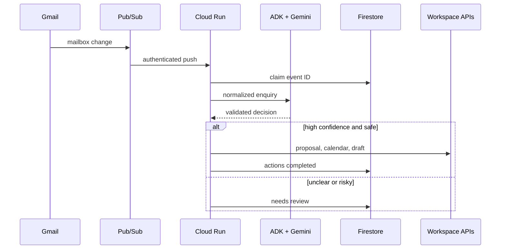
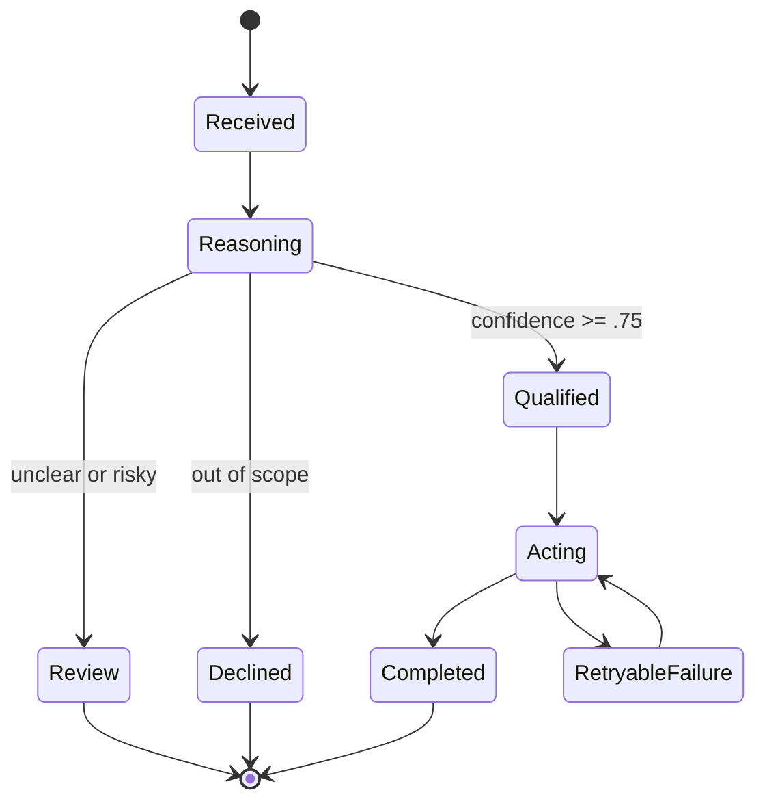

# Architecture decisions

## Event and state flow

```mermaid
sequenceDiagram
  participant G as Gmail
  participant P as Pub/Sub
  participant C as Cloud Run
  participant A as ADK + Gemini
  participant F as Firestore
  participant W as Workspace APIs
  G->>P: mailbox change
  P->>C: authenticated push
  C->>F: claim event ID
  C->>A: normalized enquiry
  A-->>C: validated decision
  alt high confidence and safe
    C->>W: proposal, calendar, draft
    C->>F: actions completed
  else unclear or risky
    C->>F: needs review
  end
```

## State machine

```mermaid
stateDiagram-v2
  [*] --> Received
  Received --> Reasoning
  Reasoning --> Qualified: confidence >= .75
  Reasoning --> Review: unclear or risky
  Reasoning --> Declined: out of scope
  Qualified --> Acting
  Acting --> Completed
  Acting --> RetryableFailure
  RetryableFailure --> Acting
  Review --> [*]
  Declined --> [*]
  Completed --> [*]
```
